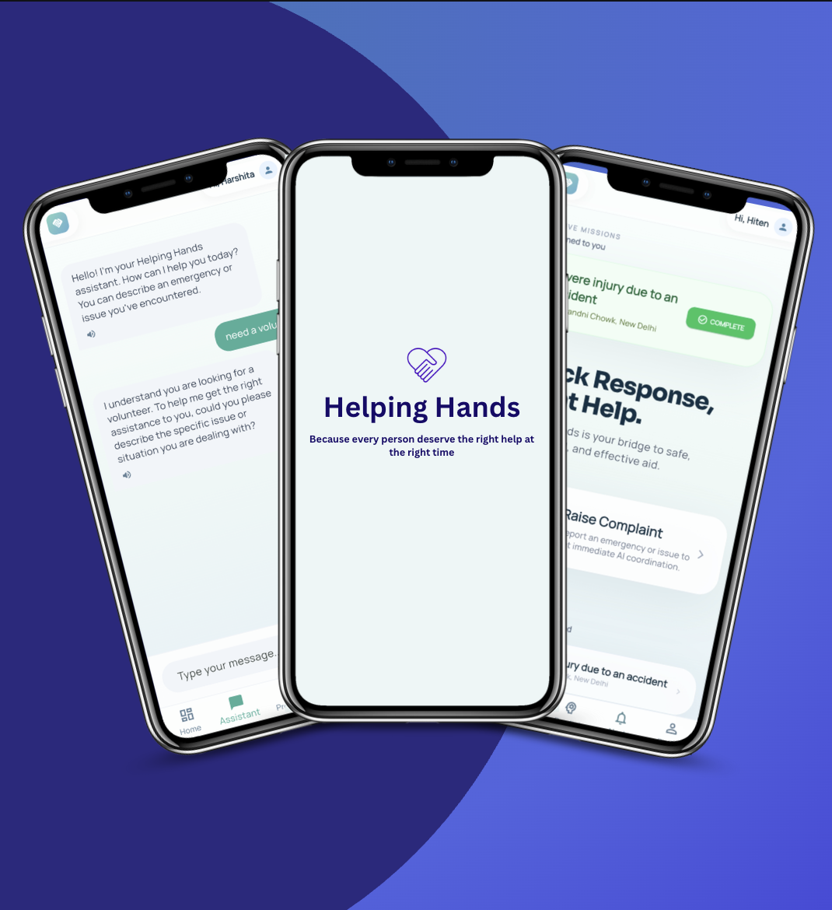

## Helping Hands

<p align="center">
  
</p>

<p align="center">
  <b>AI-Powered NGO Coordination Platform</b>
  <br/>
  Because every person deserves the right help at the right time.
</p>

<p align="center">
  <a href="https://gen-lang-client-0575655524.web.app">
    🌐 Live Website
  </a>
  &nbsp;•&nbsp;
  <a href="https://gen-lang-client-0575655524-app.web.app/">
    📱 Mobile App
  </a>
  &nbsp;•&nbsp;
  <a href="https://www.youtube.com/watch?v=kPn-Dk0rqr8">
    🎥 Demo Video
  </a>
</p>

---

## About The Project

Helping Hands is an AI-driven platform built to help NGOs manage and resolve community issues efficiently.

The platform collects issues through chatbot conversations and NGO PDF uploads, converts them into structured reports using AI/NLP, and intelligently assigns the best volunteers in real time.

---

## Key Features

- 🤖 AI chatbot for issue reporting  
- 📄 NGO PDF upload & data extraction  
- 🧠 NLP-based structured report generation  
- 🎯 Smart volunteer assignment using cosine similarity  
- 📊 Live issue tracking dashboard  
- 🔄 Automatic reassignment for inactive volunteers  
- 📈 Predictive analytics using external APIs  
- 🌐 Web + Mobile Application support  

---

## Tech Stack

<p align="center">


</p>

- **Frontend:** React + TypeScript  
- **Mobile:** Flutter (Dart)  
- **Backend:** Node.js + Express.js  
- **Hosting:** Firebase Hosting + Render  
- **AI/NLP:** Gemini API, NLP Pipelines  
- **Cloud:** Google Cloud  
- **APIs:** REST APIs  

---

## AI Workflow

```text
User / NGO Input
        ↓
Chatbot + PDF Processing
        ↓
AI/NLP Structuring
        ↓
Similarity Matching Engine
        ↓
Volunteer Assignment
        ↓
Live Tracking Dashboard
